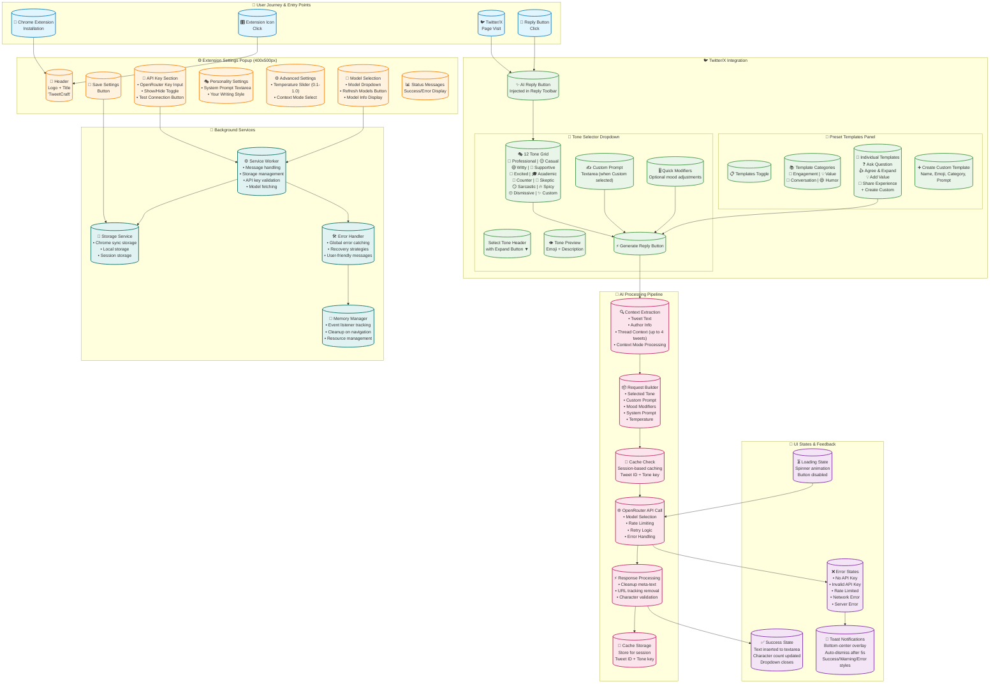

# 🎨 TweetCraft Extension - Visual Architecture Diagrams

This document contains the visual architectural diagrams for TweetCraft extension. These Mermaid diagrams will render automatically on GitHub and other compatible markdown viewers.

---

## 📊 Diagram 1: Complete Architecture & User Journey

---

## 🎨 Diagram 2: Detailed UI Components & Wireframes

```mermaid
graph TB
    %% Extension Popup Detailed Layout
    subgraph "ExtPopup [🎛️ Extension Popup 400x500px]"
        subgraph "Header [Header - Gradient Blue Background]"
            Logo["🎨 TweetCraft Logo<br/>48x48px"]
            Title["TweetCraft<br/>Craft perfect replies with AI"]
        end
        
        subgraph "Content [Main Content Area - Scrollable]"
            subgraph "APISection [API Key Configuration]"
                APILabel["OpenRouter API Key:"]
                APIInput["Password Input + Show/Hide + Test Button"]
                APIHelp["Get key at openrouter.ai/keys"]
                APIStatus["✅ Test Result Display"]
            end
            
            subgraph "ModelSection [Model Selection]"
                ModelLabel["Model:"]
                ModelSelect["GPT-4o Default + Refresh Button"]
                ModelInfo["Context & Pricing Info"]
            end
            
            subgraph "StyleSection [Writing Style]"
                StyleLabel["Your Style/Personality:"]
                StyleTextarea["Large textarea for custom personality"]
            end
            
            subgraph "Settings [Advanced Settings]"
                TempLabel["Temperature: 0.7"]
                TempSlider["0.1 ←→ 1.0 Slider"]
                ContextLabel["Context Mode:"]
                ContextDropdown["None/Single/Thread options"]
            end
        end
        
        subgraph "Footer [Footer Actions]"
            SaveButton["💾 Save Settings Button"]
            StatusMsg["Status Message Area"]
        end
    end

    %% Twitter Integration UI
    subgraph "TwitterUI [🐦 Twitter/X Integration]"
        subgraph "ReplyArea [Twitter Reply Box]"
            OriginalTweet["📝 Original Tweet Display"]
            ReplyTextarea["✍️ Reply Textarea"]
            TwitterToolbar["🔧 Twitter Toolbar + AI Reply Button"]
        end
        
        subgraph "AIDropdown [AI Reply Dropdown Overlay]"
            DropdownHeader["🎭 Select Tone + Expand ▼"]
            
            subgraph "ToneGrid [12 Tone Options - 3x4 Grid]"
                Row1["💼 Professional | 😊 Casual | 😄 Witty"]
                Row2["🤗 Supportive | 🎉 Excited | 🎓 Academic"]
                Row3["🤔 Counter | 🤨 Skeptic | 😏 Sarcastic"]
                Row4["🔥 Spicy | 🙄 Dismissive | ✨ Custom"]
            end
            
            CustomSection["📝 Custom Prompt Textarea<br/>Shows when Custom selected"]
            
            ModifierSection["🎚️ Quick Modifiers<br/>Optional mood adjustments"]
            
            PreviewSection["👁️ Tone Preview<br/>Emoji + Description"]
            
            subgraph "Templates [Preset Templates - Expandable]"
                TemplateHeader["📋 Preset Templates Toggle"]
                Categories["🎯 Engagement | 💡 Value | 💬 Conversation | 😄 Humor"]
                TemplateList["❓ Ask Question<br/>👍 Agree & Expand<br/>💡 Add Value<br/>🤝 Challenge Politely<br/>➕ Create Custom"]
            end
            
            GenerateBtn["⚡ Generate Reply Button"]
        end
    end

    %% Advanced Features
    subgraph "Advanced [🚀 Advanced Features]"
        subgraph "MultiSuggestion [Multiple Suggestion Mode]"
            SugHeader["🎪 3 Suggestions Mode"]
            SugCards["Card 1: Professional<br/>Card 2: Casual<br/>Card 3: Creative"]
            SugNav["◀️ ▶️ Navigation + 1️⃣2️⃣3️⃣"]
            SugActions["✅ Use This | 🔄 Regenerate"]
        end
        
        subgraph "TemplateCreator [Custom Template Dialog]"
            CreatorForm["Template Name Input<br/>Emoji Input<br/>Category Selector<br/>Prompt Textarea<br/>Description Input<br/>Cancel | Save Buttons"]
        end
        
        subgraph "ContextViewer [Thread Context Display]"
            ThreadView["🧵 Thread Context<br/>Up to 4 tweets analyzed<br/>@user1: Original tweet<br/>@user2: Response<br/>@you: Your reply context"]
        end
    end

    %% UI States & Feedback
    subgraph "States [📱 UI States & Feedback]"
        LoadingState["⏳ Loading Animation<br/>Spinner in button<br/>Disabled state"]
        
        SuccessState["✅ Success Feedback<br/>Text inserted<br/>Character count update<br/>Smooth transitions"]
        
        ErrorState["❌ Error Handling<br/>Toast notifications<br/>Error messages<br/>Recovery suggestions"]
        
        Responsive["📱 Responsive Design<br/>Compact mode<br/>Mobile-friendly<br/>Touch interactions"]
        
        Accessibility["♿ Accessibility<br/>Keyboard navigation<br/>Screen reader support<br/>ARIA labels<br/>Focus management"]
    end

    %% Flow Connections
    Logo --> APIInput
    SaveButton --> TwitterToolbar
    TwitterToolbar --> DropdownHeader
    ToneGrid --> GenerateBtn
    Templates --> GenerateBtn
    GenerateBtn --> LoadingState
    LoadingState --> SuccessState
    LoadingState --> ErrorState
    
    %% Multi-suggestion flow
    GenerateBtn --> SugCards
    SugCards --> SugActions
    
    %% Template creation flow
    TemplateList --> CreatorForm
    
    %% Context awareness flow
    OriginalTweet --> ThreadView
    ThreadView --> GenerateBtn

    %% Styling
    classDef popup fill:#fff3e0,stroke:#f57c00,stroke-width:2px
    classDef twitter fill:#e8f5e8,stroke:#388e3c,stroke-width:2px
    classDef advanced fill:#fce4ec,stroke:#c2185b,stroke-width:2px
    classDef states fill:#e1f5fe,stroke:#0277bd,stroke-width:2px
    
    class Header,Content,Footer,APISection,ModelSection,StyleSection,Settings popup
    class ReplyArea,AIDropdown,DropdownHeader,ToneGrid,CustomSection,ModifierSection,PreviewSection,Templates twitter
    class MultiSuggestion,TemplateCreator,ContextViewer advanced
    class LoadingState,SuccessState,ErrorState,Responsive,Accessibility states
```

---

## 🚀 Diagram 3: Feature Matrix & Enhancement Roadmap

```mermaid
graph TB
    subgraph "CurrentFeatures [🎯 Current MVP Features v0.0.1]"
        subgraph "CoreAI [🧠 AI Core Features]"
            AIGeneration["⚡ AI Reply Generation<br/>✅ OpenRouter API integration<br/>✅ Multiple model support<br/>✅ Rate limiting<br/>✅ Error handling"]
            
            ToneSystem["🎭 Tone System<br/>✅ 12 predefined tones<br/>✅ Visual emoji interface<br/>✅ Custom tone support<br/>✅ Mood modifiers"]
            
            ContextAware["🧵 Context Processing<br/>✅ Thread context analysis<br/>✅ Up to 4 tweets<br/>✅ Multiple context modes<br/>✅ Smart content extraction"]
        end
        
        subgraph "UserInterface [🎨 User Interface]"
            ExtensionPopup["⚙️ Extension Settings<br/>✅ API key management<br/>✅ Model selection<br/>✅ Personality customization<br/>✅ Temperature control"]
            
            TwitterIntegration["🐦 Twitter Integration<br/>✅ Reply box injection<br/>✅ Tone selector dropdown<br/>✅ Loading states<br/>✅ Error feedback"]
            
            TemplateSystem["📝 Template System<br/>✅ 12+ preset templates<br/>✅ Category organization<br/>✅ Custom template creation<br/>✅ Template dialog"]
        end
        
        subgraph "Technical [🔧 Technical Features]"
            Architecture["🏗️ Architecture<br/>✅ TypeScript + Webpack<br/>✅ Manifest V3<br/>✅ Memory management<br/>✅ Clean folder structure"]
            
            DataManagement["💾 Data Management<br/>✅ Chrome storage APIs<br/>✅ Session caching<br/>✅ Settings persistence<br/>✅ Privacy-focused"]
        end
    end

    subgraph "Enhancement [🚀 Enhancement Opportunities]"
        subgraph "UIUXImprovements [🎨 UI/UX Enhancements]"
            ResponsiveDesign["📱 Mobile Responsiveness<br/>🔄 Optimize for mobile Twitter<br/>🔄 Touch-friendly interactions<br/>🔄 Adaptive layouts<br/>🔄 Gesture support"]
            
            AdvancedAnimations["✨ Advanced Animations<br/>🔄 Smooth transitions<br/>🔄 Loading micro-interactions<br/>🔄 Success celebrations<br/>🔄 Contextual feedback"]
            
            ThemeCustomization["🎨 Theme System<br/>🔄 Dark mode support<br/>🔄 Custom color schemes<br/>🔄 Accessibility themes<br/>🔄 User preferences"]
            
            KeyboardShortcuts["⌨️ Keyboard Shortcuts<br/>🔄 Alt+Q quick generate<br/>🔄 Tone hotkeys 1-9,0<br/>🔄 Navigation shortcuts<br/>🔄 Power user features"]
        end
        
        subgraph "FeatureExpansions [⚡ Feature Expansions]"
            MultiSuggestions["🎪 Multiple Suggestions<br/>🔄 Generate 3 variations<br/>🔄 Different creativity levels<br/>🔄 Suggestion carousel<br/>🔄 A/B testing options"]
            
            SmartTemplates["🧠 Smart Templates<br/>🔄 AI-generated templates<br/>🔄 Context-aware suggestions<br/>🔄 Learning from usage<br/>🔄 Popular template discovery"]
            
            ReplyChaining["🔗 Conversation Chaining<br/>🔄 Multi-turn conversations<br/>🔄 Context memory<br/>🔄 Follow-up suggestions<br/>🔄 Conversation threads"]
            
            ContentAnalysis["🔍 Content Intelligence<br/>🔄 Sentiment analysis<br/>🔄 Topic detection<br/>🔄 Engagement prediction<br/>🔄 Optimal timing suggestions"]
        end
        
        subgraph "PlatformExpansion [🌐 Platform Expansion]"
            MultiPlatform["📱 Multi-Platform Support<br/>🔄 LinkedIn integration<br/>🔄 Facebook comments<br/>🔄 Reddit replies<br/>🔄 Discord messages"]
            
            MobileApp["📱 Mobile App<br/>🔄 Native mobile extension<br/>🔄 iOS Safari extension<br/>🔄 Android Chrome support<br/>🔄 Cross-device sync"]
            
            WebApp["🌐 Standalone Web App<br/>🔄 Browser-independent<br/>🔄 Direct API integration<br/>🔄 Cross-platform compatibility<br/>🔄 PWA features"]
        end
    end

    subgraph "Advanced [🔬 Advanced Capabilities]"
        subgraph "AIEnhancements [🤖 AI Enhancements]"
            ModelComparison["⚖️ Model Comparison<br/>🔄 Side-by-side generation<br/>🔄 Model performance metrics<br/>🔄 Cost comparison<br/>🔄 Quality scoring"]
            
            PersonalizedAI["👤 Personalization<br/>🔄 Learning from user style<br/>🔄 Adaptive tone selection<br/>🔄 Personal writing patterns<br/>🔄 Engagement optimization"]
            
            AdvancedContext["🧠 Advanced Context<br/>🔄 Cross-tweet analysis<br/>🔄 User history awareness<br/>🔄 Trending topic integration<br/>🔄 Real-time data inclusion"]
        end
        
        subgraph "Analytics [📊 Analytics & Insights]"
            UsageAnalytics["📈 Usage Analytics<br/>🔄 Generation statistics<br/>🔄 Tone preferences<br/>🔄 Success rate tracking<br/>🔄 Performance insights"]
            
            EngagementTracking["📊 Engagement Tracking<br/>🔄 Reply performance<br/>🔄 Like/retweet rates<br/>🔄 Response quality metrics<br/>🔄 Improvement suggestions"]
            
            ABTesting["🧪 A/B Testing<br/>🔄 Reply variant testing<br/>🔄 Tone effectiveness<br/>🔄 Template performance<br/>🔄 Optimization recommendations"]
        end
        
        subgraph "Collaboration [👥 Collaboration Features]"
            TeamFeatures["👥 Team Features<br/>🔄 Shared templates<br/>🔄 Brand voice consistency<br/>🔄 Team analytics<br/>🔄 Approval workflows"]
            
            CommunityTemplates["🌍 Community Features<br/>🔄 Template marketplace<br/>🔄 User-generated content<br/>🔄 Voting and ratings<br/>🔄 Template sharing"]
        end
    end

    subgraph "TechnicalImprovements [⚙️ Technical Improvements]"
        subgraph "Performance [⚡ Performance]"
            Optimization["🏎️ Performance Optimization<br/>🔄 Lazy loading<br/>🔄 Code splitting<br/>🔄 Memory optimization<br/>🔄 Faster API calls"]
            
            Caching["💾 Advanced Caching<br/>🔄 Persistent cache<br/>🔄 Smart invalidation<br/>🔄 Offline support<br/>🔄 Predictive caching"]
            
            BackgroundProcessing["⚙️ Background Processing<br/>🔄 Preload suggestions<br/>🔄 Background analysis<br/>🔄 Predictive generation<br/>🔄 Smart prefetching"]
        end
        
        subgraph "Security [🔒 Security & Privacy]"
            EnhancedSecurity["🛡️ Enhanced Security<br/>🔄 End-to-end encryption<br/>🔄 Local processing options<br/>🔄 Data anonymization<br/>🔄 Privacy controls"]
            
            ComplianceFeatures["📋 Compliance<br/>🔄 GDPR compliance<br/>🔄 Data export/import<br/>🔄 Audit logging<br/>🔄 Consent management"]
        end
        
        subgraph "Architecture [🏗️ Architecture]"
            Microservices["🔧 Microservices<br/>🔄 Modular architecture<br/>🔄 Plugin system<br/>🔄 API marketplace<br/>🔄 Third-party integrations"]
            
            CloudSync["☁️ Cloud Sync<br/>🔄 Cross-device settings<br/>🔄 Backup and restore<br/>🔄 Account management<br/>🔄 Subscription features"]
        end
    end

    %% Priority Levels
    subgraph "PriorityMatrix [🎯 Priority Matrix for Development]"
        HighPriority["🔴 High Priority (Next Release)<br/>• Mobile responsiveness<br/>• Keyboard shortcuts<br/>• Multiple suggestions<br/>• Dark mode<br/>• Performance optimization"]
        
        MediumPriority["🟡 Medium Priority (Future Releases)<br/>• Multi-platform support<br/>• Advanced analytics<br/>• Template marketplace<br/>• Personalization AI<br/>• Team features"]
        
        LongTerm["🟢 Long Term (Roadmap)<br/>• Native mobile apps<br/>• Standalone web app<br/>• Advanced AI models<br/>• Enterprise features<br/>• API marketplace"]
    end

    %% Connections showing evolution paths
    ToneSystem --> MultiSuggestions
    TemplateSystem --> SmartTemplates
    ContextAware --> ReplyChaining
    TwitterIntegration --> MultiPlatform
    ExtensionPopup --> MobileApp
    DataManagement --> CloudSync
    Architecture --> Microservices

    %% Styling
    classDef current fill:#e8f5e8,stroke:#388e3c,stroke-width:3px
    classDef enhancement fill:#fff3e0,stroke:#f57c00,stroke-width:2px
    classDef advanced fill:#fce4ec,stroke:#c2185b,stroke-width:2px
    classDef technical fill:#e1f5fe,stroke:#0277bd,stroke-width:2px
    classDef priority fill:#f3e5f5,stroke:#7b1fa2,stroke-width:3px
    
    class CoreAI,UserInterface,Technical current
    class UIUXImprovements,FeatureExpansions,PlatformExpansion enhancement
    class AIEnhancements,Analytics,Collaboration advanced
    class Performance,Security,Architecture technical
    class HighPriority,MediumPriority,LongTerm priority
```

---

## 📋 How to Use These Diagrams

### 🔍 **Viewing Options**

1. **GitHub/GitLab**: Diagrams render automatically in markdown viewers
2. **Mermaid Live Editor**: Copy/paste code into [mermaid.live](https://mermaid.live)
3. **VS Code**: Install Mermaid Preview extension
4. **Obsidian**: Native Mermaid support
5. **Notion**: Paste as code blocks with `mermaid` language

### 🎨 **Customization**

To modify these diagrams:
1. Copy the Mermaid code
2. Edit in [Mermaid Live Editor](https://mermaid.live)
3. Export as PNG/SVG for presentations
4. Update this file with changes

### 📊 **Export Options**

For presentations or documentation:
- **PNG/SVG**: Use Mermaid Live Editor export
- **PDF**: Print from browser with diagrams rendered
- **Integration**: Embed in documentation tools

---

## 🎯 **Diagram Legend**

| Color | Meaning | Use Case |
|-------|---------|----------|
| 🟢 **Green** | Current Features | What's working now |
| 🟡 **Orange** | Near-term Enhancements | Next 1-2 releases |
| 🔴 **Red** | Processing/Critical Path | Core user flows |
| 🔵 **Blue** | Technical Infrastructure | Background services |
| 🟣 **Purple** | Future/Advanced Features | Long-term roadmap |

These visual diagrams complement the detailed markdown architecture documentation and provide:

- **🎯 Quick visual understanding** of system architecture
- **🔄 Interactive exploration** of user flows  
- **🚀 Strategic planning** with enhancement roadmaps
- **📊 Stakeholder communication** with clear visual representations
- **🎨 Design guidance** for UI/UX improvements

Perfect for presentations, technical discussions, and development planning! 🚀
