# 🎨 TweetCraft AI Social Media Suite - Comprehensive Visual Architecture

This document contains the complete architectural diagrams for TweetCraft - a comprehensive AI-powered social media automation suite with 38+ features across content generation, research, analysis, and workflow automation.

---

## 📊 Diagram 1: Complete 38+ Feature System Architecture

```mermaid
graph TB
    %% Core System Ecosystem
    subgraph "CoreSuite [🎯 TweetCraft AI Suite - 38+ Features]"
        subgraph "ContentGen [🚀 Content Generation (7 Features)]"
            ReplyGen["💬 AI Reply Generation<br/>✅ 12 tones, context-aware<br/>✅ Thread analysis (4 tweets)<br/>✅ Custom prompts"]
            
            TweetGen["✨ AI Tweet Creation<br/>🔄 Topic-to-tweet generation<br/>🔄 Style options (engaging/educational)<br/>🔄 Auto hashtag suggestions"]
            
            ThreadComp["🧵 Thread Composer<br/>🔄 Multi-tweet structuring<br/>🔄 Flow optimization<br/>🔄 Character management"]
            
            QuoteGen["💬 Quote Tweet Generator<br/>🔄 Intelligent commentary<br/>🔄 Context-aware quotes<br/>🔄 Engagement optimization"]
            
            BulkGen["📊 Bulk Generator<br/>🔄 Multiple tweets simultaneously<br/>🔄 Template-based batching<br/>🔄 Scheduled preparation"]
            
            SmartEnhance["⚡ Smart Enhancement<br/>🔄 AI content optimization<br/>🔄 Engagement improvements<br/>🔄 Tone adjustments"]
        end
        
        subgraph "Research [🔍 Research & Analysis (10 Features)]"
            ResearchAssist["🔬 Research Assistant<br/>✅ Real-time data (Perplexity)<br/>✅ Multiple depth levels<br/>✅ Source citations"]
            
            ContentAnalysis["📊 Content Analysis<br/>✅ Sentiment analysis<br/>✅ Engagement prediction<br/>✅ Viral assessment"]
            
            ThreadAnalysis["🧵 Thread Analysis<br/>🔄 Structure optimization<br/>🔄 Coherence scoring<br/>🔄 Flow analysis"]
            
            FactCheck["✅ Fact Checker<br/>🔄 Real-time verification<br/>🔄 Source validation<br/>🔄 Misinformation detection"]
            
            PsychSuite["🧠 Psychology Suite<br/>🔄 Emotional analysis<br/>🔄 Persuasion techniques<br/>🔄 Behavioral impact"]
            
            UnifiedAnalysis["🤖 Unified AI Analysis<br/>🔄 Multi-dimensional insights<br/>🔄 Cross-model analysis<br/>🔄 Comprehensive reports"]
        end
        
        subgraph "Automation [🤖 Automation & Workflow (8 Features)]"
            AutoPost["🚀 Automated Posting<br/>🔄 RapidAPI TwttrAPI primary<br/>🔄 Intent + DOM fallbacks<br/>🔄 Safety toggles (OFF default)"]
            
            WorkflowMgr["🔄 Workflow Manager<br/>🔄 Template automation<br/>🔄 Multi-step workflows<br/>🔄 Scheduled actions"]
            
            GrowthAnalytics["📈 Growth Analytics<br/>🔄 Follower trends<br/>🔄 Engagement monitoring<br/>🔄 Performance dashboard"]
            
            EngagementDash["❤️ Engagement Dashboard<br/>🔄 Real-time monitoring<br/>🔄 Interaction tracking<br/>🔄 Community health"]
            
            CommandPalette["⌨️ Command Palette<br/>🔄 Keyboard shortcuts<br/>🔄 Quick actions<br/>🔄 Custom commands"]
            
            InlineComposer["✏️ Inline Composer<br/>🔄 Floating toolbar<br/>🔄 Context suggestions<br/>🔄 Quick actions"]
        end
        
        subgraph "Advanced [🔬 Advanced AI Features (13+ Features)]"
            O3Writing["🧠 O3 Advanced Writing<br/>🔄 Cutting-edge models<br/>🔄 Complex reasoning<br/>🔄 Premium quality"]
            
            PersonaMgmt["👤 Persona Management<br/>🔄 Multiple voices<br/>🔄 Brand consistency<br/>🔄 Voice switching"]
            
            AudienceInsights["👥 Audience Insights<br/>🔄 Demographics analysis<br/>🔄 Engagement patterns<br/>🔄 Posting optimization"]
            
            ModelComparison["⚖️ Model Comparison<br/>🔄 Side-by-side generation<br/>🔄 Performance metrics<br/>🔄 Cost analysis"]
            
            NBestGen["🎪 N-Best Generation<br/>🔄 3 variants per request<br/>🔄 Style roulette<br/>🔄 Parameter jitter"]
            
            QualityRerank["🏆 Quality Reranking<br/>🔄 Cohere-powered filtering<br/>🔄 Human-preference learning<br/>🔄 Cliche detection"]
            
            NoveltyGate["🛡️ Novelty Gate<br/>🔄 3-gram Jaccard similarity<br/>🔄 Duplicate prevention<br/>🔄 200-item history"]
            
            CadenceMimic["🎯 Cadence Mimic<br/>🔄 Top-reply style matching<br/>🔄 Punctuation adaptation<br/>🔄 Length optimization"]
            
            OneCrumb["🔍 One-Crumb Facts<br/>🔄 Perplexity integration<br/>🔄 18-word facts<br/>🔄 40% chance, 450ms limit"]
        end
    end

    %% Multi-API Integration
    subgraph "APIs [🌐 Multi-Provider API Ecosystem]"
        subgraph "Primary [Primary AI Providers]"
            OpenRouter["🤖 OpenRouter<br/>✅ GPT-4, Claude, Gemini<br/>✅ 50+ models<br/>✅ Primary generation"]
            
            RapidAPI["⚡ RapidAPI<br/>🔄 TwttrAPI posting<br/>🔄 Old Bird context<br/>🔄 Multiple providers"]
            
            Perplexity["🔍 Perplexity<br/>🔄 Real-time research<br/>🔄 Fact-checking<br/>🔄 Source validation"]
        end
        
        subgraph "Enhancement [Quality Enhancement APIs]"
            Cohere["🏆 Cohere<br/>🔄 Response reranking<br/>🔄 Quality filtering<br/>🔄 Embedding models"]
            
            JinaAI["🔗 Jina AI<br/>🔄 Advanced embeddings<br/>🔄 Semantic analysis<br/>🔄 Content understanding"]
            
            ExaAI["🔎 Exa AI<br/>🔄 Web search<br/>🔄 Content discovery<br/>🔄 Trend analysis"]
            
            XAI["🆚 X.AI<br/>🔄 Alternative models<br/>🔄 Grok integration<br/>🔄 Competitive analysis"]
        end
    end

    %% Enhanced Processing Pipeline
    subgraph "Pipeline [🧠 Advanced AI Processing Pipeline]"
        MultiContext["🧵 Multi-Context Analysis<br/>🔄 Thread reconstruction<br/>🔄 Cross-tweet analysis<br/>🔄 User history awareness<br/>🔄 Real-time data inclusion"]
        
        AdvancedGeneration["⚡ Advanced Generation<br/>🔄 N-best structured output<br/>🔄 Style roulette (5 types)<br/>🔄 Parameter jitter<br/>🔄 Topic-aware routing"]
        
        QualityPipeline["🏆 Quality Enhancement<br/>🔄 Cohere reranking (≤450ms)<br/>🔄 Novelty gate (Jaccard ≥0.58)<br/>🔄 Cadence matching<br/>🔄 Fact enhancement"]
        
        PostingChain["🚀 Automated Posting<br/>🔄 TwttrAPI (RapidAPI)<br/>🔄 Share Intent fallback<br/>🔄 DOM click backup<br/>🔄 3-second UNDO"]
    end

    %% User Interface Ecosystem
    subgraph "UI [🎨 Multi-Modal User Interface]"
        subgraph "Popup [Extension Popup - Expanded]"
            APIKeys["🔑 7 API Key Management<br/>OpenRouter/Rapid/Perplexity<br/>Cohere/Jina/Exa/X.AI"]
            
            ContentSettings["📝 Content Generation<br/>Model routing/Temperature<br/>Persona management<br/>Advanced AI features"]
            
            AutomationControls["🤖 Automation Controls<br/>Auto-post toggle (OFF default)<br/>Posting chain config<br/>Safety features"]
            
            AnalyticsConfig["📊 Analytics Configuration<br/>Growth tracking<br/>Psychology analytics<br/>Performance monitoring"]
        end
        
        subgraph "TwitterIntegration [Twitter/X Integration]"
            EnhancedToolbar["🔧 Enhanced Toolbar<br/>[✨AI] [🧵Thread] [📊Analytics]<br/>[🔍Research] [💡Enhance] [⚡Bulk]"]
            
            CommandInterface["⌨️ Command Palette<br/>Ctrl+Shift+T: Open palette<br/>Alt+R: Quick reply<br/>Alt+A: Analyze<br/>Custom shortcuts"]
            
            AnalyticsOverlay["📊 Analytics Overlay<br/>Real-time insights<br/>Engagement predictions<br/>Viral potential scores"]
            
            ResearchPanel["🔍 Research Panel<br/>Topic analysis<br/>Fact checking<br/>Source validation"]
        end
    end

    %% Flow Connections
    ContentGen --> MultiContext
    Research --> AdvancedGeneration  
    Automation --> QualityPipeline
    Advanced --> PostingChain
    
    APIKeys --> OpenRouter
    APIKeys --> RapidAPI
    APIKeys --> Perplexity
    ContentSettings --> AdvancedGeneration
    AutomationControls --> PostingChain
    
    EnhancedToolbar --> MultiContext
    CommandInterface --> QualityPipeline
    AnalyticsOverlay --> PostingChain
    
    %% Styling
    classDef core fill:#e8f5e8,stroke:#388e3c,stroke-width:3px
    classDef apis fill:#fff3e0,stroke:#f57c00,stroke-width:2px
    classDef pipeline fill:#fce4ec,stroke:#c2185b,stroke-width:2px
    classDef ui fill:#e1f5fe,stroke:#0277bd,stroke-width:2px
    
    class ContentGen,Research,Automation,Advanced core
    class Primary,Enhancement apis
    class MultiContext,AdvancedGeneration,QualityPipeline,PostingChain pipeline
    class Popup,TwitterIntegration ui
```

---

## 🏗️ Diagram 2: Phased Implementation Strategy with Safety Architecture

```mermaid
graph TB
    %% Current MVP State
    subgraph "Current [✅ v0.0.1 MVP - Currently Implemented]"
        subgraph "WorkingCore [Core Working Features]"
            CurrentReply["💬 AI Reply Generation<br/>✅ OpenRouter API<br/>✅ 12 tone system<br/>✅ Thread context"]
            
            CurrentUI["🎨 Basic UI<br/>✅ Extension popup<br/>✅ Tone selector<br/>✅ Template system"]
            
            CurrentTech["🔧 Technical Foundation<br/>✅ TypeScript + Webpack<br/>✅ Chrome Manifest V3<br/>✅ Memory management"]
        end
    end

    %% Phase 1: Zero-Risk Improvements
    subgraph "Phase1 [🟢 Phase 1: Zero-Risk Improvements (v0.0.2)]"
        subgraph "UIEnhancements [UI Polish - No Logic Changes]"
            CharCounter["📊 Character Counter<br/>🔄 Visual feedback<br/>🔄 Real-time counting<br/>🔄 Color coding"]
            
            ProgressText["⏳ Progress Indicators<br/>🔄 Loading states<br/>🔄 Generation progress<br/>🔄 Success animations"]
            
            HoverEffects["✨ Visual Feedback<br/>🔄 Hover animations<br/>🔄 Focus indicators<br/>🔄 Smooth transitions"]
            
            KeyboardShorts["⌨️ Keyboard Shortcuts<br/>🔄 Alt+Q quick generate<br/>🔄 Navigation keys<br/>🔄 Power user features"]
        end
    end

    %% Phase 2: Low-Risk Enhancements  
    subgraph "Phase2 [🟡 Phase 2: Low-Risk Enhancements (v0.1.0)]"
        subgraph "IsolatedSystems [Isolated New Systems]"
            SessionCache["💾 Enhanced Caching<br/>🔄 Session persistence<br/>🔄 Performance optimization<br/>🔄 Smart invalidation"]
            
            DraftSaving["📝 Draft Management<br/>🔄 Auto-save drafts<br/>🔄 Recovery system<br/>🔄 Multiple drafts"]
            
            ToneMemory["🎭 Tone Preferences<br/>🔄 Remember last used<br/>🔄 Personal defaults<br/>🔄 Context suggestions"]
            
            EnhancedErrors["🛠️ Better Error Handling<br/>🔄 Recovery strategies<br/>🔄 User-friendly messages<br/>🔄 Automatic retries"]
        end
    end

    %% Phase 3: Medium-Risk Features
    subgraph "Phase3 [🔶 Phase 3: Core Logic Extensions (v0.2.0)]"
        subgraph "CoreExtensions [Extended Core Features]"
            RetryLogic["🔄 Advanced Retry Logic<br/>🔄 Exponential backoff<br/>🔄 Smart failure handling<br/>🔄 Multiple provider fallback"]
            
            ThreadContext["🧵 Enhanced Thread Analysis<br/>🔄 Deep context understanding<br/>🔄 Cross-tweet correlation<br/>🔄 Conversation flow"]
            
            ModelRouting["🤖 Dynamic Model Selection<br/>🔄 Topic-aware routing<br/>🔄 Performance optimization<br/>🔄 Cost management"]
            
            TempControl["🌡️ Advanced Temperature<br/>🔄 Dynamic adjustment<br/>🔄 Context-aware settings<br/>🔄 Quality optimization"]
        end
    end

    %% Phase 4: Advanced AI Features
    subgraph "Phase4 [🔴 Phase 4: Advanced AI Pipeline (v0.3.0)]"
        subgraph "AIAdvanced [Advanced AI Features]"
            NBestSafeImplementation["🎪 N-Best Generation<br/>🔄 Feature flag: nBestEnabled<br/>🔄 Fallback to single generation<br/>🔄 JSON schema with error handling"]
            
            QualityRerankSafe["🏆 Quality Reranking<br/>🔄 Feature flag: rerankEnabled<br/>🔄 450ms timeout with fallback<br/>🔄 Cohere API optional"]
            
            NoveltyGateSafe["🛡️ Novelty Gate<br/>🔄 Feature flag: noveltyEnabled<br/>🔄 3-gram Jaccard threshold<br/>🔄 Local storage management"]
            
            CadenceMimicSafe["🎯 Cadence Matching<br/>🔄 Feature flag: cadenceEnabled<br/>🔄 Top-reply analysis<br/>🔄 Safe DOM parsing"]
        end
    end

    %% Phase 5: Multi-API Integration
    subgraph "Phase5 [🔥 Phase 5: Multi-API Integration (v0.4.0)]"
        subgraph "APIExpansion [API Provider Expansion]"
            PerplexityIntegration["🔍 Perplexity Research<br/>🔄 Real-time fact checking<br/>🔄 One-crumb enhancement<br/>🔄 Research assistant"]
            
            CohereIntegration["🏆 Cohere Reranking<br/>🔄 Quality filtering<br/>🔄 Human preference learning<br/>🔄 Cliche detection"]
            
            RapidAPIPosting["🚀 RapidAPI Posting<br/>🔄 TwttrAPI integration<br/>🔄 Auto-post with fallbacks<br/>🔄 Safety controls"]
            
            MultiProviderMgmt["🌐 Multi-Provider Management<br/>🔄 API key rotation<br/>🔄 Load balancing<br/>🔄 Error recovery"]
        end
    end

    %% Phase 6: Enterprise Features
    subgraph "Phase6 [🌟 Phase 6: Enterprise Features (v1.0.0)]"
        subgraph "EnterpriseFeatures [Advanced Business Features]"
            PersonaManagement["👤 Persona Management<br/>🔄 Multiple brand voices<br/>🔄 Voice consistency<br/>🔄 Team collaboration"]
            
            AnalyticsDashboard["📊 Analytics Dashboard<br/>🔄 Growth tracking<br/>🔄 Engagement analytics<br/>🔄 Performance insights"]
            
            WorkflowAutomation["🔄 Workflow Automation<br/>🔄 Scheduled posting<br/>🔄 Template automation<br/>🔄 Bulk operations"]
            
            CommandPaletteFull["⌨️ Command Palette<br/>🔄 Power user interface<br/>🔄 Custom shortcuts<br/>🔄 Quick actions"]
        end
    end

    %% Safety & Feature Flag System
    subgraph "Safety [🛡️ Safety & Feature Flag Architecture]"
        subgraph "FeatureFlags [Feature Flag System]"
            FlagConfig["⚙️ Feature Flag Configuration<br/>🔄 Individual feature toggles<br/>🔄 Safe defaults (OFF)<br/>🔄 Progressive enablement"]
            
            SafetyWrappers["🛠️ Safety Wrappers<br/>🔄 Try-catch all new features<br/>🔄 Fallback to v0.0.1 behavior<br/>🔄 Error isolation"]
            
            RollbackSystem["🔙 Rollback System<br/>🔄 Emergency reset button<br/>🔄 Version fallback<br/>🔄 No-downtime recovery"]
            
            IsolatedTesting["🧪 Isolated Testing<br/>🔄 Feature-specific tests<br/>🔄 Gradual rollout<br/>🔄 Performance monitoring"]
        end
        
        subgraph "SafetyPatterns [Implementation Safety Patterns]"
            ProgressiveEnhancement["📈 Progressive Enhancement<br/>🔄 Extend, don't modify<br/>🔄 Additive features only<br/>🔄 Backward compatibility"]
            
            GracefulDegradation["📉 Graceful Degradation<br/>🔄 Feature failure tolerance<br/>🔄 Automatic fallbacks<br/>🔄 User notification"]
            
            ErrorRecovery["🔧 Error Recovery<br/>🔄 Automatic retry logic<br/>🔄 Smart failure detection<br/>🔄 Recovery strategies"]
        end
    end

    %% Implementation Flow
    Current --> Phase1
    Phase1 --> Phase2
    Phase2 --> Phase3
    Phase3 --> Phase4
    Phase4 --> Phase5
    Phase5 --> Phase6
    
    %% Safety Integration
    FlagConfig --> Phase2
    SafetyWrappers --> Phase3
    RollbackSystem --> Phase4
    IsolatedTesting --> Phase5
    
    ProgressiveEnhancement --> Phase3
    GracefulDegradation --> Phase4
    ErrorRecovery --> Phase5

    %% Styling
    classDef current fill:#e8f5e8,stroke:#388e3c,stroke-width:3px
    classDef phase1 fill:#e1f5fe,stroke:#0277bd,stroke-width:2px
    classDef phase2 fill:#fff3e0,stroke:#f57c00,stroke-width:2px
    classDef phase3 fill:#fce4ec,stroke:#c2185b,stroke-width:2px
    classDef phase4 fill:#f3e5f5,stroke:#7b1fa2,stroke-width:2px
    classDef phase5 fill:#fde293,stroke:#d97706,stroke-width:2px
    classDef phase6 fill:#dcfce7,stroke:#16a34a,stroke-width:2px
    classDef safety fill:#fef3c7,stroke:#ca8a04,stroke-width:3px
    
    class WorkingCore current
    class UIEnhancements phase1
    class IsolatedSystems phase2
    class CoreExtensions phase3
    class AIAdvanced phase4
    class APIExpansion phase5
    class EnterpriseFeatures phase6
    class FeatureFlags,SafetyPatterns safety
```

---

## 🎯 Diagram 3: Complete 38+ Feature Roadmap & Implementation Matrix

```mermaid
graph TB
    %% Current Working Features (5 Core)
    subgraph "Working [✅ Currently Working (5 Features)]"
        ActiveReply["💬 AI Reply Generation<br/>✅ OpenRouter integration<br/>✅ 12 tone system<br/>✅ Thread context analysis<br/>✅ Custom prompts"]
        
        ActiveTweetGen["✨ AI Tweet Creation<br/>✅ Topic-to-tweet generation<br/>✅ Style options<br/>✅ Hashtag suggestions<br/>✅ Character validation"]
        
        ActiveResearch["🔬 Research Assistant<br/>✅ Perplexity API<br/>✅ Multiple depth levels<br/>✅ Source citations<br/>✅ Fact-checking"]
        
        ActiveAnalysis["📊 Content Analysis<br/>✅ Sentiment analysis<br/>✅ Engagement prediction<br/>✅ Viral assessment<br/>✅ Psychology metrics"]
        
        ActiveSettings["⚙️ Settings Management<br/>✅ Chrome storage<br/>✅ API key management<br/>✅ User preferences<br/>✅ Cross-device sync"]
    end

    %% Backend Ready Features (29 Features)
    subgraph "BackendReady [🔧 Backend Ready (29 Features - 95% Built)]"
        subgraph "ContentCreation [📝 Content Creation Suite]"
            ThreadComposer["🧵 Thread Composer<br/>🔧 Multi-tweet structuring<br/>🔧 Flow optimization<br/>🔧 Auto numbering"]
            
            BulkGenerator["📊 Bulk Generator<br/>🔧 Batch processing<br/>🔧 Template automation<br/>🔧 Scheduled preparation"]
            
            QuoteTweetGen["💬 Quote Tweet Generator<br/>🔧 Intelligent commentary<br/>🔧 Context awareness<br/>🔧 Engagement optimization"]
            
            SmartEnhancer["⚡ Smart Enhancement<br/>🔧 AI optimization<br/>🔧 Engagement improvements<br/>🔧 Data integration"]
        end
        
        subgraph "AdvancedAnalysis [🔍 Advanced Analysis Features]"
            ThreadAnalysis["🧵 Thread Analysis<br/>🔧 Structure scoring<br/>🔧 Coherence analysis<br/>🔧 Flow optimization"]
            
            FactChecker["✅ Fact Checker<br/>🔧 Real-time verification<br/>🔧 Source validation<br/>🔧 Misinformation detection"]
            
            PsychologyAnalysis["🧠 Psychology Suite<br/>🔧 Emotional analysis<br/>🔧 Persuasion techniques<br/>🔧 Behavioral impact"]
            
            UnifiedAnalysis["🤖 Unified AI Analysis<br/>🔧 Multi-dimensional insights<br/>🔧 Cross-model analysis<br/>🔧 Comprehensive reports"]
            
            AudienceInsights["👥 Audience Analytics<br/>🔧 Demographics analysis<br/>🔧 Engagement patterns<br/>🔧 Growth predictions"]
        end
        
        subgraph "Automation [🤖 Automation & Workflows]"
            WorkflowManager["🔄 Workflow Manager<br/>🔧 Template automation<br/>🔧 Scheduled actions<br/>🔧 Multi-step flows"]
            
            GrowthAnalytics["📈 Growth Analytics<br/>🔧 Follower trends<br/>🔧 Engagement monitoring<br/>🔧 Performance dashboard"]
            
            EngagementDash["❤️ Engagement Dashboard<br/>🔧 Real-time monitoring<br/>🔧 Interaction tracking<br/>🔧 Community health"]
            
            CommandPalette["⌨️ Command Palette<br/>🔧 Quick actions<br/>🔧 Custom shortcuts<br/>🔧 Action history"]
            
            InlineComposer["✏️ Inline Composer<br/>🔧 Floating toolbar<br/>🔧 Context suggestions<br/>🔧 Quick buttons"]
        end
        
        subgraph "AdvancedAI [🧠 Advanced AI Features]"
            O3Writing["🧠 O3 Advanced Writing<br/>🔧 Cutting-edge models<br/>🔧 Complex reasoning<br/>🔧 Premium quality"]
            
            PersonaManager["👤 Persona Management<br/>🔧 Multiple voices<br/>🔧 Brand consistency<br/>🔧 Voice switching"]
            
            ModelComparison["⚖️ Model Comparison<br/>🔧 Side-by-side testing<br/>🔧 Performance metrics<br/>🔧 Cost analysis"]
            
            HistoryViewer["📚 History Viewer<br/>🔧 Generation tracking<br/>🔧 Search/filter<br/>🔧 Performance analysis"]
        end
    end

    %% Next Implementation Priority (High Impact)
    subgraph "NextPhase [🚀 Next Implementation (High Impact)]"
        subgraph "RapidAPIUpgrades [RapidAPI Integration]"
            AutoPosting["🚀 Automated Posting<br/>🔥 TwttrAPI (RapidAPI)<br/>🔥 Share Intent fallback<br/>🔥 DOM click backup<br/>🔥 Safety controls"]
            
            OldBirdContext["📖 Old Bird Context<br/>🔥 Read-only fallback<br/>🔥 Tweet/author fetching<br/>🔥 DOM enhancement"]
        end
        
        subgraph "AIQualityFeatures [AI Quality Enhancements]"
            NBestGeneration["🎪 N-Best Generation<br/>🔥 3 variants per call<br/>🔥 Style roulette<br/>🔥 Parameter jitter<br/>🔥 JSON schema"]
            
            QualityReranking["🏆 Quality Reranking<br/>🔥 Cohere integration<br/>🔥 Human preference<br/>🔥 Cliche detection<br/>🔥 450ms timeout"]
            
            NoveltyGateImpl["🛡️ Novelty Gate<br/>🔥 3-gram Jaccard<br/>🔥 Duplicate prevention<br/>🔥 200-item history<br/>🔥 Smart nudging"]
            
            CadenceMimicImpl["🎯 Cadence Mimic<br/>🔥 Top-reply analysis<br/>🔥 Style matching<br/>🔥 Punctuation adaptation<br/>🔥 Length optimization"]
            
            OneCrumbFacts["🔍 One-Crumb Facts<br/>🔥 Perplexity integration<br/>🔥 18-word facts<br/>🔥 40% probability<br/>🔥 URL detection"]
            
            TopicRouting["🎯 Topic-Aware Routing<br/>🔥 Code/Finance/General<br/>🔥 Model optimization<br/>🔥 Performance/cost balance"]
        end
    end

    %% Future Enterprise Features
    subgraph "Enterprise [🌟 Enterprise & Advanced (v1.0.0+)]"
        subgraph "BusinessFeatures [Business & Team Features]"
            TeamCollaboration["👥 Team Features<br/>🔮 Shared templates<br/>🔮 Brand consistency<br/>🔮 Approval workflows<br/>🔮 Team analytics"]
            
            CommunityMarketplace["🌍 Template Marketplace<br/>🔮 Community sharing<br/>🔮 Rating system<br/>🔮 Template discovery<br/>🔮 Monetization"]
            
            EnterpriseIntegration["🏢 Enterprise Integration<br/>🔮 SSO authentication<br/>🔮 Admin controls<br/>🔮 Usage monitoring<br/>🔮 Compliance features"]
        end
        
        subgraph "PlatformExpansion [Platform Expansion]"
            MultiPlatformSupport["📱 Multi-Platform<br/>🔮 LinkedIn integration<br/>🔮 Reddit automation<br/>🔮 Discord integration<br/>🔮 Facebook comments"]
            
            NativeMobileApps["📱 Native Mobile<br/>🔮 iOS Safari extension<br/>🔮 Android Chrome<br/>🔮 Cross-device sync<br/>🔮 Mobile-first UI"]
            
            StandaloneWebApp["🌐 Web Application<br/>🔮 Browser-independent<br/>🔮 PWA features<br/>🔮 Direct API access<br/>🔮 Cross-platform"]
        end
    end

    %% Multi-Provider API Architecture
    subgraph "MultiAPI [🌐 Multi-Provider API Architecture]"
        CoreProviders["🔧 Core Providers (Currently Integrated)<br/>✅ OpenRouter (Primary AI)<br/>✅ Chrome Storage APIs<br/>✅ Twitter DOM APIs"]
        
        EnhancementProviders["⚡ Enhancement Providers (Backend Ready)<br/>🔧 RapidAPI (TwttrAPI posting)<br/>🔧 Perplexity (Research/facts)<br/>🔧 Cohere (Quality reranking)<br/>🔧 Jina AI (Embeddings)<br/>🔧 Exa AI (Web search)<br/>🔧 X.AI (Alternative models)<br/>🔧 Microlink (URL analysis)"]
        
        SafetyAPI["🛡️ Safety & Monitoring<br/>🔧 Rate limiting system<br/>🔧 API health monitoring<br/>🔧 Automatic failover<br/>🔧 Usage analytics<br/>🔧 Cost tracking"]
    end

    %% Implementation Priority Matrix
    subgraph "Priority [🎯 Implementation Priority Matrix]"
        subgraph "Immediate [🔴 Immediate (v0.0.2-0.1.0)]"
            PhaseOneFeatures["Phase 1 Features:<br/>• Character counter<br/>• Progress indicators<br/>• Keyboard shortcuts<br/>• Enhanced caching<br/>• Draft management"]
        end
        
        subgraph "HighImpact [🔥 High Impact (v0.2.0-0.3.0)]"
            PhaseThreeFeatures["Core AI Enhancements:<br/>• N-Best generation<br/>• Quality reranking<br/>• Novelty gate<br/>• Cadence mimicking<br/>• Topic routing"]
        end
        
        subgraph "Strategic [🌟 Strategic (v0.4.0+)]"
            EnterpriseFeatures["Enterprise Features:<br/>• Multi-API integration<br/>• Automated posting<br/>• Team collaboration<br/>• Analytics dashboard<br/>• Platform expansion"]
        end
    end

    %% Flow Connections showing evolution
    Working --> BackendReady
    BackendReady --> NextPhase
    NextPhase --> Enterprise
    
    CoreProviders --> EnhancementProviders
    EnhancementProviders --> SafetyAPI
    
    Immediate --> HighImpact
    HighImpact --> Strategic

    %% Styling
    classDef working fill:#e8f5e8,stroke:#388e3c,stroke-width:4px
    classDef backend fill:#fff3e0,stroke:#f57c00,stroke-width:3px
    classDef next fill:#fce4ec,stroke:#c2185b,stroke-width:3px
    classDef enterprise fill:#f3e5f5,stroke:#7b1fa2,stroke-width:2px
    classDef api fill:#e1f5fe,stroke:#0277bd,stroke-width:2px
    classDef priority fill:#fef3c7,stroke:#ca8a04,stroke-width:3px
    
    class ActiveReply,ActiveTweetGen,ActiveResearch,ActiveAnalysis,ActiveSettings working
    class ContentCreation,AdvancedAnalysis,Automation,AdvancedAI backend
    class RapidAPIUpgrades,AIQualityFeatures next
    class BusinessFeatures,PlatformExpansion enterprise
    class CoreProviders,EnhancementProviders,SafetyAPI api
    class Immediate,HighImpact,Strategic priority
```

---

## 📋 Comprehensive System Overview & Usage Guide

### 🎯 **TweetCraft Scope: 38+ Features Across 7 Categories**

#### **✅ Currently Working (5 Core Features)**
- **AI Reply Generation** - OpenRouter integration with 12 tones
- **AI Tweet Creation** - Topic-to-tweet with style options  
- **Research Assistant** - Perplexity-powered real-time research
- **Content Analysis** - Sentiment, engagement, viral potential
- **Settings Management** - Multi-API key management

#### **🔧 Backend Ready (29 Features - 95% Built)**
- **Content Creation** (6): Thread composer, bulk generator, quote tweets, enhancement
- **Advanced Analysis** (10): Psychology suite, fact checker, audience insights, unified analysis
- **Automation** (8): Workflow manager, growth analytics, engagement dashboard, command palette
- **Advanced AI** (5): O3 writing, persona management, model comparison, history viewer

#### **🔥 Next Priority Implementation**
Based on `future features v2.md` detailed implementation plan:
- **RapidAPI Integration** - TwttrAPI posting, Old Bird context
- **AI Quality Pipeline** - N-Best generation, Cohere reranking, novelty gate
- **Advanced Features** - Cadence mimicking, one-crumb facts, topic routing

### 🏗️ **Implementation Strategy (from UPGRADE_STRATEGY.md)**

#### **Safety-First Development Approach**
| Phase | Risk Level | Features | Safety Pattern |
|-------|------------|----------|----------------|
| **Phase 1** | 🟢 Zero Risk | UI polish, shortcuts | Additive only |
| **Phase 2** | 🟡 Low Risk | Caching, drafts | Isolated systems |
| **Phase 3** | 🔶 Medium Risk | Enhanced logic | Feature flags |
| **Phase 4** | 🔴 High Risk | AI pipeline | Comprehensive testing |
| **Phase 5** | 🔥 Complex | Multi-API | Fallback chains |
| **Phase 6** | 🌟 Enterprise | Team features | Enterprise architecture |

#### **Core Safety Principles**
1. **Never modify existing working code** - extend it
2. **Feature flags for all new features** - can disable if issues arise  
3. **Fallback to v0.0.1 behavior** if any new feature fails
4. **Test each feature in isolation** before integrating

### 🔍 **Using These Diagrams for Planning**

#### **📊 For Development Planning**
- **Diagram 1**: Complete system understanding - use for sprint planning
- **Diagram 2**: Phased approach - use for release planning and risk management
- **Diagram 3**: Feature priority matrix - use for backlog management

#### **🎨 For Design & Product**  
- **Feature scope visualization** - understand the full product vision
- **User journey mapping** - plan UX flows across 38+ features
- **Enhancement prioritization** - focus on high-impact, low-risk improvements

#### **📈 For Stakeholder Communication**
- **System complexity demonstration** - show the comprehensive scope
- **Implementation timeline** - realistic phased development approach
- **Risk mitigation strategy** - safety-first development methodology

### 🎯 **Immediate Action Items (Based on Architecture)**

#### **🔴 High Priority (v0.0.2-0.1.0)**
1. **Zero-risk UI improvements** - character counter, progress indicators
2. **Keyboard shortcuts** - Alt+Q, navigation keys, power user features
3. **Enhanced caching** - session persistence, performance optimization
4. **Draft management** - auto-save, recovery system

#### **🔥 Next Phase (v0.2.0-0.3.0)**  
1. **RapidAPI integration** - posting automation with safety controls
2. **N-Best generation** - 3 variants with style roulette
3. **Quality reranking** - Cohere-powered human preference filtering
4. **Novelty gate** - prevent repetitive responses

#### **🌟 Strategic (v0.4.0+)**
1. **Multi-API ecosystem** - 7 provider integration
2. **Enterprise features** - team collaboration, analytics dashboard
3. **Platform expansion** - LinkedIn, Reddit, Discord support

### 📚 **Documentation Cross-Reference**

| Document | Purpose | Usage |
|----------|---------|-------|
| **ARCHITECTURE.md** | Complete technical specs | Development implementation |
| **future features.md** | 38+ feature catalog | Feature planning |
| **future features v2.md** | Detailed implementation plan | Technical implementation |
| **UPGRADE_STRATEGY.md** | Safety patterns & phases | Risk management |

### 🔍 **Viewing & Export Options**

#### **GitHub/Online Viewing**  
- Diagrams render automatically on GitHub
- Compatible with GitLab, Bitbucket markdown
- Real-time editing in Mermaid Live Editor

#### **Local Development Tools**
- **VS Code**: Mermaid Preview extension
- **Obsidian**: Native Mermaid support  
- **Notion**: Code blocks with `mermaid` language
- **Export**: PNG/SVG via Mermaid Live Editor

---

## 🎯 **Strategic Development Framework**

This architectural documentation provides:

- **📊 Complete scope understanding** - 38+ features across 7 categories
- **🛡️ Risk-managed implementation** - phased approach with safety patterns
- **🚀 Strategic roadmap** - from MVP to enterprise solution  
- **🔧 Technical specifications** - implementation-ready details
- **📈 Business planning** - feature prioritization and market expansion

**Perfect foundation for scaling TweetCraft from a simple reply assistant to a comprehensive AI-powered social media automation suite!** 🚀
