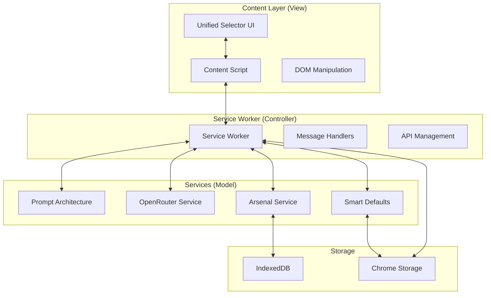

# TweetCraft Chrome Extension - Comprehensive Technical Report

## 1. Project Executive Summary

TweetCraft is a consumer-focused Chrome extension (v0.0.20) that provides AI-powered reply generation for Twitter/X and HypeFury platforms. The extension leverages OpenRouter's API to offer users 24 distinct personalities, 11 vocabulary styles, 15 rhetorical approaches, and 6 pacing options, creating over 24,750 possible reply combinations.

**Primary Purpose:** To help users craft engaging, contextually appropriate social media replies using AI assistance, with a focus on consumer simplicity rather than enterprise complexity.

**Target Audience:** Social media users who want to enhance their engagement quality and speed, particularly on Twitter/X and HypeFury platforms.

**Key Value Propositions:**
- Instant AI-powered reply generation with contextual awareness
- Learning system that adapts to user preferences over time
- Multi-platform support with consistent experience
- Arsenal mode for saving and reusing successful replies
- Visual content analysis through integrated vision models

## 2. Technology Stack & Dependencies

### Core Technologies
- **Language:** TypeScript 4.9+ with strict mode enabled
- **Runtime:** Chrome Extension Manifest V3 with Service Worker architecture
- **Build System:** Webpack 5 with separate dev/prod configurations
- **Package Manager:** npm (v8+)
- **Target:** ES2020 JavaScript

### Key Dependencies
```json
{
  "Production Dependencies": {
    "@google/generative-ai": "^0.21.0",
    "cheerio": "^1.0.0",
    "nanoid": "^5.0.4",
    "marked": "^11.1.0"
  },
  "Development Dependencies": {
    "@typescript-eslint/parser": "^6.14.0",
    "webpack": "^5.89.0",
    "webpack-cli": "^5.1.4",
    "sass": "^1.69.5",
    "jest": "^29.7.0",
    "ts-jest": "^29.1.1"
  }
}
```

### External Services
- **OpenRouter API:** Primary AI model provider (multiple model fallback)
- **TwitterAPI.io:** Analytics and trending data (not official Twitter API)
- **Chrome Storage API:** Settings and preference persistence
- **IndexedDB:** Arsenal mode reply storage

## 3. Architectural Analysis

### High-Level Architecture Pattern
The project follows a **Modified MVC Pattern** with Service Worker as the controller layer:



### Key Architectural Decisions
1. **Consumer-First Design:** Explicitly avoids enterprise patterns (factories, DI) for simplicity
2. **Message Passing Architecture:** All communication through Chrome runtime messages
3. **Singleton Pattern:** Content script runs as singleton to prevent duplication
4. **Service-Oriented:** Core functionality split into specialized services
5. **Progressive Disclosure UX:** Complex features hidden by default

## 4. Codebase Structure & Key Files

### Directory Structure
```
tweetcraft/
├── src/
│   ├── background/
│   │   └── serviceWorker.ts (2,093 lines) - Central message hub
│   ├── content/
│   │   ├── contentScript.ts - Main content injection
│   │   └── unifiedSelector.ts (9,947 lines) - MONOLITHIC UI COMPONENT
│   ├── services/
│   │   ├── promptArchitecture.ts - Strategic prompt construction
│   │   ├── openRouter.ts - Resilient API client
│   │   ├── arsenalService.ts - IndexedDB management
│   │   └── smartDefaults.ts - ML-based usage patterns
│   ├── config/
│   │   ├── personalities.ts - 24 personality definitions
│   │   ├── vocabulary.ts - 11 vocabulary styles
│   │   ├── rhetoric.ts - 15 rhetorical approaches
│   │   └── lengthPacing.ts - 6 pacing options
│   └── types/
│       └── messages.ts - Message type definitions
├── build/
│   ├── webpack.common.js - Shared webpack config
│   ├── webpack.dev.js - Development config
│   └── webpack.prod.js - Production optimization
├── public/
│   ├── manifest.json - Chrome extension manifest
│   └── popup.html - Extension popup interface
└── tests/
    └── promptArchitecture.test.ts - Core service tests
```

### Most Critical Files

1. **serviceWorker.ts (2,093 lines)**
   - Handles 30+ message types
   - Implements retry logic and fallback chains
   - Manages API communication
   - Coordinates all extension services

2. **unifiedSelector.ts (9,947 lines) - CRITICAL ISSUE**
   - Monolithic component violating single responsibility
   - Contains all UI logic, event handling, and inline styles
   - Major refactoring candidate

3. **promptArchitecture.ts**
   - Strategic prompt construction for all 6 tabs
   - Strict validation with descriptive errors
   - Tab-specific configuration management

4. **openRouter.ts**
   - Request deduplication (30s cache)
   - Intelligent batching (200ms windows)
   - Offline queue (max 50 requests)
   - 3-model fallback chain

5. **smartDefaults.ts**
   - Usage pattern tracking
   - Content-based suggestions
   - Time-of-day patterns
   - Weekly statistics generation

## 5. Data Model & Persistence

### Chrome Storage Schema
```typescript
{
  // API Configuration
  'tweetcraft_api_key': string,
  'tweetcraft_model': string,
  
  // User Preferences
  'tweetcraft_last_selections': {
    personality?: string,
    vocabulary?: string,
    rhetoric?: string,
    lengthPacing?: string,
    timestamp: number
  },
  
  // Usage Patterns
  'tweetcraft_time_patterns': Array<{
    hour: number,
    personality: string,
    successRate: number,
    count: number
  }>,
  
  // Smart Defaults
  'tweetcraft_smart_defaults': {
    personality?: string,
    vocabulary?: string,
    rhetoric?: string,
    lengthPacing?: string,
    confidence: 'high' | 'medium' | 'low',
    reason: string
  }
}
```

### IndexedDB Schema (Arsenal Mode)
```typescript
{
  database: 'TweetCraftArsenal',
  version: 1,
  stores: {
    arsenalReplies: {
      keyPath: 'id',
      indexes: [
        { name: 'category', keyPath: 'category' },
        { name: 'templateId', keyPath: 'templateId' },
        { name: 'toneId', keyPath: 'toneId' },
        { name: 'usageCount', keyPath: 'usageCount' },
        { name: 'lastUsed', keyPath: 'lastUsed' }
      ]
    },
    favoriteTemplates: {
      keyPath: 'id',
      indexes: [
        { name: 'combo', keyPath: 'combo', unique: true },
        { name: 'usageCount', keyPath: 'usageCount' }
      ]
    }
  }
}
```

## 6. Core Algorithms & Business Logic

### 1. Smart Defaults Algorithm
```typescript
// Priority-based selection system
1. Content Analysis (confidence >= 0.8)
   - Keyword matching against 40+ patterns
   - Returns personality, vocabulary, rhetoric suggestions
   
2. Time-Based Patterns (confidence >= medium)
   - Tracks hourly usage patterns
   - Provides time-specific recommendations
   
3. Historical Usage (MIN_USAGE >= 3)
   - Analyzes top used combinations
   - Weighted by success rate
   
4. Fallback Defaults
   - personality: 'friendly'
   - vocabulary: 'plain_english'
   - rhetoric: 'agree_build'
   - lengthPacing: 'drive_by'
```

### 2. Request Optimization
```typescript
// Network resilience pattern
class RequestOptimizer {
  - Request Deduplication: 30-second cache TTL
  - Intelligent Batching: 200ms window aggregation
  - Offline Queue: Max 50 requests, 5-minute TTL
  - Adaptive Timeouts: 30-90 seconds based on connection
  - Model Fallback: gpt-4o-mini → claude-3-haiku → llama-3.1-8b
}
```

### 3. Template Suggestion Scoring
```typescript
// Multi-factor scoring algorithm
calculateScore(context) {
  baseScore = 5.0
  + contextRelevance (0-2 points)
  + personalityMatch (0-1 point)
  + timeOfDayBonus (0-1 point)
  + usageHistoryBoost (0-1 point)
  = finalScore (0-10)
}
```

## 7. API & External Interfaces

### Chrome Extension APIs
```typescript
// Message Types (30+ defined)
enum MessageType {
  // Core Generation
  GENERATE_REPLY = 'generateReply',
  ANALYZE_IMAGES = 'analyzeImages',
  SUGGEST_TEMPLATE = 'suggestTemplate',
  
  // Configuration
  GET_CONFIG = 'getConfig',
  SET_CONFIG = 'setConfig',
  GET_API_KEY = 'getApiKey',
  SET_API_KEY = 'setApiKey',
  
  // Storage Management
  GET_STORAGE = 'getStorage',
  SET_STORAGE = 'setStorage',
  CLEAR_DATA = 'clearData',
  
  // Analytics
  RESET_USAGE_STATS = 'resetUsageStats',
  GET_WEEKLY_STATS = 'getWeeklyStats'
}
```

### OpenRouter API Integration
```typescript
// Primary endpoint
POST https://openrouter.ai/api/v1/chat/completions
Headers: {
  'Authorization': 'Bearer {API_KEY}',
  'Content-Type': 'application/json',
  'HTTP-Referer': 'chrome-extension://{EXTENSION_ID}'
}

// Request structure
{
  model: string, // e.g., 'gpt-4o-mini'
  messages: Array<{role: string, content: string}>,
  temperature?: number,
  max_tokens?: number,
  stream?: boolean
}
```

## 8. Setup, Build, & Execution

### Development Setup
```bash
# 1. Clone repository
git clone https://github.com/[repo]/tweetcraft.git
cd tweetcraft

# 2. Install dependencies
npm install

# 3. Create .env file with API key
echo "OPENROUTER_API_KEY=your_key_here" > .env

# 4. Development build with watch
npm run dev

# 5. Load extension in Chrome
# - Open chrome://extensions/
# - Enable "Developer mode"
# - Click "Load unpacked"
# - Select /dist folder

# 6. Test on supported platforms
# - Navigate to twitter.com or x.com
# - Extension UI should appear on reply buttons
```

### Production Build
```bash
# Clean build
npm run clean && npm run build

# Run tests
npm run test

# Type checking
npm run type-check

# Linting
npm run lint
```

### Available Scripts
```json
{
  "dev": "webpack --config build/webpack.dev.js --watch",
  "build": "webpack --config build/webpack.prod.js",
  "clean": "rm -rf dist",
  "test": "jest",
  "test:watch": "jest --watch",
  "lint": "eslint . --ext .ts,.tsx",
  "type-check": "tsc --noEmit"
}
```

## 9. Quality, Testing, & CI/CD

### Testing Strategy
- **Framework:** Jest with ts-jest preset
- **Test Environment:** jsdom for DOM simulation
- **Coverage Targets:** Not explicitly defined (gap identified)
- **Test Files:** 
  - `promptArchitecture.test.ts` - Core service tests
  - `promptArchitectureComprehensive.test.ts` - Integration tests

### Code Quality Tools
- **TypeScript:** Strict mode enabled with comprehensive checks
- **ESLint:** Extended from recommended configs
  - @typescript-eslint/recommended
  - @typescript-eslint/recommended-requiring-type-checking
- **Key Rules:**
  - No unused variables (with exceptions for _ prefix)
  - Prefer const over let
  - No var declarations
  - Console logs allowed (needed for extension debugging)

### CI/CD Configuration
**CRITICAL GAP:** No CI/CD pipeline configuration found. No GitHub Actions, Jenkins, or other automation setup detected.

### Bundle Analysis
- **Current Size:** 716KB (2.93x over 244KB threshold)
- **Load Time Impact:** 3-5 seconds
- **Memory Usage:** 150-200MB (target: <50MB)

## 10. Critical Assessment & Recommendations

### Strengths
1. **Consumer-Focused Architecture:** Successfully avoids enterprise over-engineering
2. **Comprehensive Feature Set:** 24,750+ template combinations provide extensive variety
3. **Network Resilience:** Excellent error handling with offline support and fallback chains
4. **Smart Learning:** Usage pattern tracking provides genuine value
5. **Multi-Platform Support:** Consistent experience across Twitter/X and HypeFury

### Critical Issues

#### 1. Monolithic Component (SEVERITY: HIGH)
- **Issue:** unifiedSelector.ts at 9,947 lines violates all SOLID principles
- **Impact:** Unmaintainable, untestable, performance bottleneck
- **Recommendation:** Immediate refactoring into:
  - Separate UI components per tab
  - Extract business logic to services
  - Move styles to SCSS modules
  - Implement proper component hierarchy

#### 2. Bundle Size Crisis (SEVERITY: HIGH)
- **Issue:** 716KB bundle (3x over threshold)
- **Impact:** 3-5 second load times, poor user experience
- **Recommendations:**
  - Implement code splitting for tab components
  - Lazy load features (Arsenal, Image Gen)
  - Tree-shake unused dependencies
  - Minify and compress assets more aggressively

#### 3. Missing CI/CD Pipeline (SEVERITY: HIGH)
- **Issue:** No automated testing or deployment
- **Impact:** Manual processes prone to errors
- **Recommendation:** Implement GitHub Actions with:
  - Automated testing on PR
  - Bundle size checks
  - Type checking and linting
  - Automated version bumping
  - Chrome Web Store deployment

#### 4. Security Vulnerabilities (SEVERITY: MEDIUM)
- **Issue:** API keys passed through message channels (recently fixed but needs validation)
- **Recommendation:** 
  - Audit all message passing for sensitive data
  - Implement content security policy
  - Add rate limiting on client side
  - Regular dependency security audits

#### 5. Performance Issues (SEVERITY: MEDIUM)
- **Issue:** Memory usage 150-200MB
- **Recommendations:**
  - Implement virtual scrolling for large lists
  - Use React/Preact for efficient DOM updates
  - Implement proper cleanup on navigation
  - Add performance monitoring

### Strategic Recommendations

#### Immediate Actions (Week 1-2)
1. **Set up CI/CD pipeline** with GitHub Actions
2. **Start refactoring unifiedSelector.ts** - break into 10+ smaller components
3. **Implement code splitting** to reduce initial bundle size
4. **Add comprehensive error tracking** (Sentry or similar)

#### Short-term (Month 1)
1. **Migrate to React/Preact** for better component management
2. **Implement proper state management** (Zustand or Redux Toolkit)
3. **Add E2E testing** with Playwright
4. **Create component library** with Storybook
5. **Implement bundle size budgets** in webpack

#### Long-term (Quarter 1)
1. **Consider server-side components** for heavy processing
2. **Implement A/B testing framework** for feature rollout
3. **Add telemetry and analytics** for usage insights
4. **Create developer documentation** and API docs
5. **Plan migration to Manifest V3 best practices**

### Conclusion

TweetCraft demonstrates strong product-market fit with its consumer-focused approach and comprehensive feature set. However, critical technical debt in the form of the monolithic UI component and missing CI/CD infrastructure poses significant risks to maintainability and scalability. The immediate priority should be refactoring the unifiedSelector.ts file while simultaneously setting up automated testing and deployment pipelines. With these improvements, the extension can maintain its consumer-friendly approach while achieving the technical excellence needed for sustainable growth.

**Overall Technical Score:** 7/10
- Functionality: 9/10
- Code Quality: 5/10
- Performance: 4/10
- Maintainability: 5/10
- Testing: 3/10
- Security: 7/10
- Documentation: 8/10
