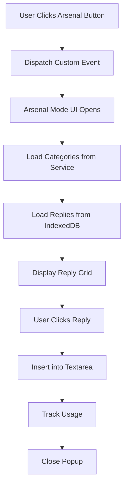

# Arsenal Mode Integration Audit
**Date:** 2025-01-09
**Task:** 1.1.1 - Audit Current Arsenal Mode
**Sprint:** 1 - Architectural Consolidation

## 📋 Executive Summary
Arsenal Mode is currently implemented as a standalone feature with its own button and popup UI. This audit documents all features, dependencies, and provides a migration plan to integrate it into the main AI popup structure.

## 🎯 Current Implementation Overview

### Location & Entry Points
- **Button Location:** Injected next to AI Reply button in tweet toolbars
- **Keyboard Shortcut:** Alt+A
- **Trigger:** Custom event `tweetcraft:open-arsenal`
- **UI Type:** Floating popup modal (500x600px)

### Core Files
1. **Frontend Components:**
   - `src/content/arsenalMode.ts` - UI component (420 lines)
   - `src/content/arsenalMode.scss` - Styles
   - Button creation in `src/content/contentScript.ts`

2. **Backend Service:**
   - `src/services/arsenalService.ts` - Data management (742 lines)
   - `src/data/arsenalReplies.json` - Pre-generated replies

3. **Storage:**
   - IndexedDB: `TweetCraftArsenal` database
   - Store: `replies` object store
   - Indexes: category, templateId, toneId, usageCount, lastUsed

## 📊 Feature Inventory

### 1. Core Features
| Feature | Description | Current Implementation | Migration Notes |
|---------|-------------|----------------------|-----------------|
| **Category Tabs** | 6 pre-defined categories | Horizontal tab bar | Move to Arsenal tab in main popup |
| **Reply Cards** | Grid display of saved replies | Custom card component | Reuse existing card styles |
| **Usage Tracking** | Track usage count per reply | IndexedDB + UI display | Maintain in migrated version |
| **Favorites** | Mark replies as favorites | Toggle with ❤️ icon | Integrate with main Favorites tab |
| **Quick Insert** | One-click reply insertion | Click to use reply | Keep same functionality |
| **Search/Filter** | Find specific replies | Not yet implemented | Add in migration |

### 2. Categories
```javascript
categories = [
  { id: 'quick', name: 'Quick Responses', emoji: '⚡' },
  { id: 'debate', name: 'Debate Arsenal', emoji: '⚔️' },
  { id: 'humor', name: 'Humor Bank', emoji: '😂' },
  { id: 'support', name: 'Support Replies', emoji: '💪' },
  { id: 'professional', name: 'Professional', emoji: '💼' },
  { id: 'viral', name: 'Viral Potential', emoji: '🔥' }
]
```

### 3. Data Structure
```typescript
interface ArsenalReply {
  id: string;
  templateId: string;
  toneId: string;
  text: string;
  category: string;
  tags: string[];
  usageCount: number;
  lastUsed?: Date;
  createdAt: Date;
  temperature: number;
  isFavorite: boolean;
}
```

## 🔄 Data Flows

### Current Flow


### Dependencies
1. **Service Dependencies:**
   - `ArsenalService` singleton instance
   - `DOMUtils` for text insertion
   - IndexedDB API for storage

2. **UI Dependencies:**
   - Custom event system for communication
   - Floating popup positioning logic
   - Category tab switching logic

3. **Data Dependencies:**
   - Pre-generated replies JSON file
   - Template/Tone definitions from preset files
   - Usage statistics in IndexedDB

## 📦 Current Arsenal Mode Features to Migrate

### Must Have (P0)
- [x] Category organization
- [x] Reply card display
- [x] One-click insertion
- [x] Usage tracking
- [x] Favorites system
- [x] Keyboard shortcut (Alt+A)

### Should Have (P1)
- [ ] Search functionality
- [ ] Filter by tags
- [ ] Bulk selection
- [x] Export/Import (exists in service)
- [x] Statistics display

### Nice to Have (P2)
- [ ] Custom categories
- [ ] Reply editing
- [ ] Reply templates
- [ ] AI generation integration
- [ ] Sharing saved replies

## 🏗️ Migration Checklist

### Phase 1: Backend Preparation
- [ ] Verify ArsenalService compatibility with main popup
- [ ] Add Arsenal message handlers to service worker
- [ ] Create ArsenalTab component matching unified selector pattern
- [ ] Ensure IndexedDB access from main popup context

### Phase 2: UI Component Creation
- [ ] Create `src/components/tabs/ArsenalTab.ts`
- [ ] Port category tab logic to main tab system
- [ ] Adapt reply card styles to main popup design
- [ ] Implement search/filter UI components
- [ ] Add bulk selection with checkboxes

### Phase 3: Integration
- [ ] Add Arsenal as 7th tab in unified selector
- [ ] Connect Arsenal tab to ArsenalService
- [ ] Implement keyboard navigation for Arsenal tab
- [ ] Update Alt+A shortcut to open main popup with Arsenal tab
- [ ] Test text insertion from main popup context

### Phase 4: Migration & Cleanup
- [ ] Add migration notice in old Arsenal button
- [ ] Implement data migration if needed
- [ ] Test all Arsenal features in new location
- [ ] Remove old Arsenal Mode button and popup
- [ ] Clean up orphaned event listeners
- [ ] Update documentation

## 🔍 Technical Considerations

### Challenges
1. **Context Switching:** Arsenal popup has its own context, main popup shares context
2. **Positioning:** Floating popup vs integrated tab layout
3. **Event System:** Custom events vs direct function calls
4. **Storage Access:** Ensure IndexedDB works from main popup
5. **Performance:** Loading all replies at once vs pagination

### Solutions
1. **Use existing tab architecture** from unified selector
2. **Implement virtual scrolling** for large reply lists
3. **Add pagination** with 20 replies per page
4. **Cache categories** in memory for faster switching
5. **Lazy load** reply details on hover

## 📈 Benefits of Integration

### User Benefits
- **Single UI:** No more separate popups to manage
- **Consistent Design:** Matches rest of TweetCraft interface
- **Better Discovery:** Arsenal more visible as main tab
- **Improved Workflow:** Switch between AI generation and saved replies
- **Unified Search:** Search across all features

### Technical Benefits
- **Code Reduction:** ~400 lines removed from duplicate UI code
- **Maintenance:** Single popup system to maintain
- **Performance:** Shared resources and caching
- **Testing:** Unified test suite for all tabs
- **Bundle Size:** Smaller overall bundle

## 📐 Proposed New Architecture

### Tab Structure
```
Main AI Popup
├── Personas Tab
├── All Tab
├── Smart Tab
├── Favorites Tab (merged with Custom)
├── Arsenal Tab (NEW - replaces external button)
├── Image Gen Tab
└── Compose Tab
```

### Arsenal Tab Layout
```
┌─────────────────────────────────────┐
│ Arsenal Mode ⚔️        [Search] [+] │
├─────────────────────────────────────┤
│ [⚡Quick] [⚔️Debate] [😂Humor] ...   │
├─────────────────────────────────────┤
│ ┌─────────┐ ┌─────────┐ ┌─────────┐│
│ │ Reply 1 │ │ Reply 2 │ │ Reply 3 ││
│ │ ❤️ Used:5│ │ 🤍 Used:2│ │ ❤️ Used:8││
│ └─────────┘ └─────────┘ └─────────┘│
│ ┌─────────┐ ┌─────────┐ ┌─────────┐│
│ │ Reply 4 │ │ Reply 5 │ │ Reply 6 ││
│ │ 🤍 Used:1│ │ 🤍 Used:0│ │ ❤️ Used:3││
│ └─────────┘ └─────────┘ └─────────┘│
│                                     │
│ [□ Select All] [Copy] [Export]     │
└─────────────────────────────────────┘
```

## 🎯 Success Criteria

### Functional Requirements
- [ ] All current Arsenal features work in new location
- [ ] No data loss during migration
- [ ] Performance equal or better than current
- [ ] Keyboard shortcuts still functional
- [ ] Search and filter capabilities added

### Non-Functional Requirements
- [ ] Load time < 500ms
- [ ] Smooth transitions between categories
- [ ] Responsive layout at all sizes
- [ ] Accessible with keyboard navigation
- [ ] No memory leaks with large datasets

## 📅 Timeline Estimate

| Task | Estimated Hours |
|------|----------------|
| Backend preparation | 2 hours |
| UI component creation | 4 hours |
| Integration work | 3 hours |
| Testing & debugging | 2 hours |
| Migration & cleanup | 1 hour |
| **Total** | **12 hours** |

## 🚀 Next Steps

1. **Immediate Actions:**
   - Create ArsenalTab component structure
   - Set up message handlers in service worker
   - Design search/filter UI mockups

2. **Development Order:**
   1. Backend message handlers
   2. ArsenalTab component
   3. Category switching logic
   4. Reply card grid
   5. Search/filter features
   6. Bulk operations
   7. Migration & cleanup

3. **Testing Plan:**
   - Unit tests for ArsenalTab component
   - Integration tests for service communication
   - E2E tests for user workflows
   - Performance tests with 1000+ replies
   - Cross-browser compatibility tests

## 📝 Notes

- Arsenal Mode is well-architected but isolated
- Integration will improve user experience significantly
- Consider adding AI generation directly to Arsenal in future
- Opportunity to add collaborative features (share arsenals)
- Migration provides chance to optimize performance

---

**Status:** ✅ Audit Complete
**Next Task:** 1.1.2 - Integrate Arsenal Features into Main Popup
