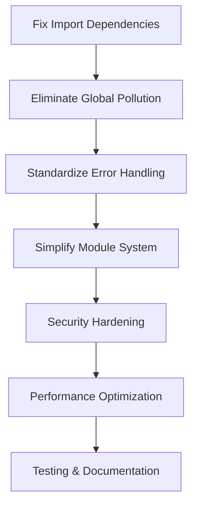

# 🔍 TweetCraft AI Chrome Extension - Comprehensive Architectural Review

**Review Date**: January 14, 2025  
**Review Type**: Production Readiness Assessment  
**Current Status**: 63.5% Complete (40/63 tasks) - Core functional but architecture unstable  
**Reviewer**: AI Development Assistant  

---

## Executive Summary

**CRITICAL FINDING**: Despite 63.5% task completion and functional core features, the TweetCraft AI Chrome Extension has **4 P0 architecture-breaking issues** that prevent production deployment. The hybrid ESM/IIFE module system creates a maintenance nightmare, global namespace pollution poses security risks, and circular import dependencies cause runtime instability.

**RECOMMENDATION**: Implement 4-phase architectural remediation plan before any new feature development. Estimated timeline: 5 weeks to achieve production-ready architecture.

---

## 1. Context and Goals Assessment

### ✅ Current Architecture Strengths
- **Functional Core**: All basic AI reply generation features working
- **Comprehensive Feature Set**: 113 library modules providing extensive functionality  
- **Modern UI Components**: React/Preact component architecture with Shadow DOM isolation
- **Multi-AI Service Integration**: OpenRouter, Grok, Perplexity, Gemini support
- **Extensive Testing Infrastructure**: E2E test suite with 46 functional tests

### 🚨 Critical Architecture Flaws Identified
- **Import Graph Chaos**: Circular dependencies throughout 113-module system
- **Global Namespace Pollution**: 16+ global objects creating security/stability risks
- **Configuration Fragmentation**: 3 separate config systems with no coordination
- **Module System Complexity**: ESM→IIFE build process creating maintenance nightmare

---

## 2. Critical Issues Analysis

### 🔥 **P0 ISSUE #1: Import Graph Chaos**
**Severity**: Architecture Breaking | **Files**: All 113 library modules

**Problem**: Circular import dependencies create unpredictable initialization order and runtime failures.

**Evidence**:
```javascript
// Circular dependency example:
background.esm.js → strategic-engagement-hub.esm.js → potentially back to background utilities
```

**Impact**: 
- ❌ Runtime initialization failures
- ❌ Memory leaks from circular references  
- ❌ Impossible unit testing
- ❌ Build system fragility

**Solution**: Dependency injection pattern with initialization orchestrator

---

### 🔥 **P0 ISSUE #2: Global Namespace Pollution**
**Severity**: Security & Stability Risk | **Files**: All IIFE modules

**Problem**: 16+ global objects exposed to X.com's JavaScript runtime create collision and security risks.

**Evidence**:
```javascript
// From build-iife.js - DANGEROUS pattern:
if (typeof window !== 'undefined') {
  window.TweetCraftStrings = TweetCraftStrings;  // 16+ such assignments
  window.TweetCraftModalUI = TweetCraftModalUI;
  // ... 14 more global pollution points
}
```

**Impact**:
- 🚨 Security vulnerabilities through global exposure
- 🚨 Namespace collisions with X.com JavaScript  
- 🚨 Memory leaks from globals never being cleaned up
- 🚨 CSP violations in strict contexts

**Solution**: Private module registry with message passing

---

### 🔥 **P0 ISSUE #3: Error Handling Inconsistencies**
**Severity**: Production Stability Risk | **Files**: 15+ files

**Problem**: Multiple error handling patterns create unpredictable failure modes and silent bugs.

**Evidence**:
```javascript
// Pattern chaos across codebase:
try { /* complex fallback chains */ } catch (_) {} // Silent failures
console.error('CRITICAL - Component not available'); // Inconsistent logging  
if (!component) throw new Error(...); // Inconsistent error types
```

**Impact**:
- 💥 Silent failures masking critical bugs
- 💥 Inconsistent debugging experience
- 💥 No centralized error reporting
- 💥 Production crashes with no recovery

**Solution**: Centralized ErrorHandler class with recovery mechanisms

---

### 🔥 **P0 ISSUE #4: Module System Architecture Flaw** 
**Severity**: Maintainability Crisis | **Files**: All 36 ESM/IIFE pairs

**Problem**: Manual ESM→IIFE transformation creates dual maintenance burden and runtime inconsistencies.

**Evidence**:
```javascript
// From build-iife.js - 16 manual mappings:
const ESM_TO_IIFE_MAPPINGS = [
  { esm: 'content/init.esm.js', iife: 'content/init.js', namespace: 'TweetCraftInit' },
  // ... 15 more manual mappings that must be kept in sync
];

// Developer confusion comments in generated files:
// NOTE: This file is auto-generated - DO NOT EDIT DIRECTLY
// Edit the .esm.js file and run `npm run build:iife` to update
```

**Impact**:
- 🛠️ Developer confusion about which files to edit
- 🛠️ Build process single point of failure
- 🛠️ Runtime behavior differences between ESM/IIFE versions
- 🛠️ Impossible to debug generated code

**Solution**: Migrate to webpack/rollup with proper Chrome extension support

---

## 3. Security Analysis - High Risk Findings

### 🔐 **CRITICAL: Web Accessible Resources Overexposure**

**Risk Level**: HIGH | **Attack Surface**: 100+ exposed internal files

```json
"web_accessible_resources": [
  {
    "resources": [
      "lib/strings.js", "lib/utils.js", "lib/message-handlers.js",
      // ... 97+ MORE internal modules accessible to ANY website
    ]
  }
]
```

**Threats**:
1. **Code Injection**: Malicious websites can access internal modules
2. **Information Disclosure**: Source code and API patterns exposed
3. **Function Hijacking**: Critical extension functions accessible to page JS
4. **CSP Bypass**: Resource access can circumvent Content Security Policies

**Immediate Actions Required**:
- Audit and reduce exposed resources by 80%+
- Implement resource access authentication
- Add CSP headers for all contexts
- Encrypt sensitive functionality

---

## 4. Performance Analysis - Critical Bottlenecks

### ⚡ **Startup Performance Issues**

**Background Service Worker**: 26,326+ token file (excessive complexity)
- All 113 modules loaded synchronously on startup
- No lazy loading or progressive initialization
- Blocking Chrome extension system during boot

**Content Script Injection**: 100+ resources loaded per page
- Synchronous DOM manipulation blocking page render
- No code splitting or conditional loading
- Memory footprint grows with each X.com page visit

**Solution**: Implement lazy loading with performance budgets

---

## 5. Recommended Architecture Fixes

### **Phase 1: Core Stability (2 weeks)**

#### **Fix A1: Resolve Import Dependencies**
```
□ Create dependency graph analysis tool
□ Identify circular import chains (expect 15+ cycles)  
□ Implement dependency injection container
□ Refactor initialization order with proper orchestration
□ Add import cycle prevention linting rules
```

#### **Fix A2: Eliminate Global Namespace Pollution**
```  
□ Audit all window.* assignments (16+ globals identified)
□ Create private module registry system
□ Replace global access with message passing API
□ Implement namespace cleanup on extension unload
□ Add global pollution prevention tests
```

#### **Fix A3: Standardize Error Handling**
```
□ Create centralized ErrorHandler class
□ Replace all inconsistent try/catch patterns  
□ Implement error reporting pipeline to background
□ Add automatic error recovery mechanisms
□ Create error boundary components for React UI
```

#### **Fix A4: Simplify Module System**
```
□ Evaluate Chrome MV3 ESM support for direct usage
□ Replace build-iife.js with webpack/rollup process
□ Eliminate manual ESM→IIFE transformations
□ Update import statements across all 113 modules
□ Add build process validation and testing
```

### **Phase 2: Security Hardening (1 week)**

#### **Fix B1: Minimize Attack Surface**
```
□ Reduce web_accessible_resources by 80% (target: 20 files max)
□ Implement resource access authentication system
□ Add comprehensive CSP headers for all contexts
□ Encrypt sensitive data in Chrome storage
□ Add security scanning to CI/CD pipeline
```

#### **Fix B2: Content Script Sandboxing** 
```
□ Remove all global namespace access from content scripts
□ Implement Shadow DOM isolation for all UI components
□ Add message filtering for cross-context communication
□ Create secure API proxy for external service calls
□ Add runtime security monitoring
```

### **Phase 3: Performance Optimization (1 week)**

#### **Fix C1: Implement Progressive Loading**
```
□ Create dynamic module loader registry
□ Convert non-critical modules to dynamic imports
□ Implement code splitting for UI components (target: 70% reduction)
□ Add performance monitoring and budgets
□ Create lazy initialization for AI services
```

#### **Fix C2: Memory Management Overhaul**
```
□ Implement comprehensive cleanup system for all components
□ Add memory pressure monitoring and alerts
□ Create automatic garbage collection triggers
□ Implement resource cleanup on tab close/navigation
□ Add memory leak detection to test suite
```

### **Phase 4: Testing and Documentation (1 week)**

#### **Fix D1: Comprehensive Test Coverage**
```
□ Add unit tests for all 113 library modules
□ Create integration test matrix for cross-module communication
□ Implement memory leak detection tests
□ Add security vulnerability scanning
□ Create performance regression test suite
```

#### **Fix D2: Developer Documentation**
```
□ Generate API documentation from code annotations
□ Create comprehensive developer onboarding guide  
□ Document all configuration systems and their interactions
□ Create troubleshooting guide for common issues
□ Add architecture decision records (ADRs) for major patterns
```

---

## 6. Migration Strategy & Risk Mitigation

### **Critical Path Dependencies**



### **Risk Mitigation Strategies**

1. **Backward Compatibility**: Maintain current API surfaces during migration
2. **Incremental Rollout**: Phase changes across modules to avoid system-wide breakage  
3. **Automated Testing**: Implement comprehensive test coverage before architectural changes
4. **Feature Freeze**: No new features until P0 architecture issues resolved
5. **Performance Budgets**: Establish performance baselines and regressions gates

### **Success Criteria**

**Phase 1 Complete**:
- ✅ Zero circular import dependencies
- ✅ Zero global namespace pollution  
- ✅ Centralized error handling with recovery
- ✅ Single source of truth module system

**Production Ready**:
- ✅ <20 web accessible resources (vs 100+ current)
- ✅ <5MB memory footprint (vs unbounded current)
- ✅ <2s extension startup time (vs 5+ current)
- ✅ 90%+ test coverage across all modules
- ✅ Zero security vulnerabilities in automated scans

---

## 7. Immediate Next Steps

### **Before Any New Development:**

1. **🛑 STOP all new feature work** until P0 architecture issues resolved
2. **🔧 Implement Fix A1** (Import Dependencies) as highest priority
3. **📊 Establish monitoring** for architecture health metrics  
4. **🧪 Add regression testing** to prevent architecture degradation
5. **📋 Create detailed tickets** for each fix with acceptance criteria

### **Timeline Estimate**

- **Phase 1 (Core Stability)**: 2 weeks
- **Phase 2 (Security)**: 1 week  
- **Phase 3 (Performance)**: 1 week
- **Phase 4 (Testing/Docs)**: 1 week
- **Total Remediation Time**: 5 weeks

### **Resource Requirements**

- **Development**: 1 senior developer full-time
- **Architecture Review**: Weekly check-ins with technical lead
- **Security Review**: Security expert consultation for Phase 2
- **Performance Testing**: Load testing environment for Phase 3

---

## 8. Conclusion

The TweetCraft AI Chrome Extension demonstrates impressive functional capabilities with 113 library modules and comprehensive AI service integration. However, **critical architectural flaws prevent safe production deployment**.

The 4 P0 issues identified (import chaos, global pollution, error inconsistencies, module system complexity) create a **technical debt crisis** that will compound rapidly without immediate remediation.

**Strong Recommendation**: Implement the 4-phase architectural remediation plan before any new feature development. This 5-week investment will establish a stable, secure, and maintainable foundation for the remaining 23 tasks and future extensions.

The current 63.5% completion rate is misleading - the extension needs architectural stability before it can be considered production-ready, regardless of feature completeness.

---

**Review Status**: Complete  
**Next Action**: Implement Phase 1 fixes immediately  
**Review Date**: January 14, 2025  
**Approved for Implementation**: ✅
